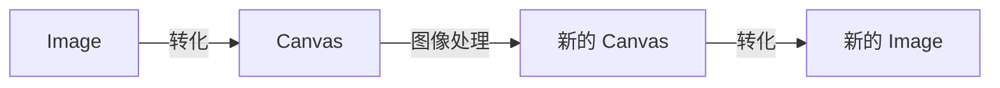

## 背景

### 本文介绍

本文

### 关键词

imageData、canvas、 图像处理、滤镜

### 功能介绍

逛 github 热榜的时候看到一个项目[visualization-collection](http://hepengwei.cn/#/gameImage),里面有很多的前端视觉效果。其中，图片处理部分（[体验地址](http://hepengwei.cn/#/gameImage)）比较有意思,对于熟悉图片处理比较有用，所以尝试进行学习和理解。

实现了对图片的简单滤镜、翻转（左右，上下）


## 流程知识点(API)介绍

### 处理流程

在浏览器中 ，图片本身是无法被修改的。如果想要处理图像（Image)，可以通过转化成 canvas 来实现。



### image 和 canvas 的相互转化

image 和 canvas 之间是可以相互转化的

#### image -> canvas

通过 `drawImage` 可以实现

```js
// 将图片绘制到画布上
ctx.drawImage(image, 0, 0);
```

#### canvas -> image

Canvas API 中的 `toDataURL` 和 `toBlob` 方法都可以将 `Canvas` 转换为图片

方法 1: 通过 `toDataURL` 实现: 可以直接用于显示图片或将图片上传到服务器

```js
// 将画布转换为base64格式的图片
const dataURL = canvas.toDataURL();
// 赋值给 Image
const newImg = document.createElement('img');
newImg.src = dataURL;
```

方法 2: 通过 `toBlob` 实现: 可以用于将图片保存到本地或上传到服务器

```js
const canvas = document.getElementById('myCanvas');
canvas.toBlob((blob) => {
  const url = URL.createObjectURL(blob);

  // 实现下载功能
  const a = document.createElement('a');
  a.href = url;
  a.download = 'myImage.png';
  a.click();
  URL.revokeObjectURL(url);
}, 'image/png');
```

### Canvas 修改（getImageData）

在知道 Image 和 Canvas 如何转化以后，我们接下来就看如何对 Canvas 进行修改。这里就需要再了解一个 API [getImageData](https://developer.mozilla.org/zh-CN/docs/Web/API/CanvasRenderingContext2D/getImageData)。

#### ImageData

`getImageData` 返回一个 ImageData 对象，用来描述 Canvas 区域隐含的像素数据。

```js
// 这个区域通过矩形表示，起始点为*(sx, sy)、宽为sw、高为sh
ImageData ctx.getImageData(sx, sy, sw, sh);
// eg: ImageData { width: 100, height: 100, data: Uint8ClampedArray[40000] }
```

返回值是一个对象，其中的 width 和 height 表示区域的宽、高。接下来看一下 data:

> ImageData.data: [Uint8ClampedArray] 描述了一个一维数组，包含以 `RGBA` 顺序的数据，数据使用 0 至 255（包含）的整数表示。

我们来做一个 demo, 比如我画一个 `2 * 2`的 Canvas, 分别填充四种颜色：

```js
// 设置画布大小为2*2
canvas.width = 2;
canvas.height = 2;

// 绘制四个点位的颜色
ctx.fillStyle = 'red';
ctx.fillRect(0, 0, 1, 1);

ctx.fillStyle = 'green';
ctx.fillRect(1, 0, 1, 1);

ctx.fillStyle = 'blue';
ctx.fillRect(0, 1, 1, 1);

ctx.fillStyle = 'white';
ctx.fillRect(1, 1, 1, 1);

// 将画布转换为base64格式的图片并打印到控制台
const imageData = ctx.getImageData(0, 0, 2, 2) as ImageData;
console.log(imageData);
```

展示的效果像这样： 

能看到 data 的返回值是一个数组，每 4 位描述一个像素点。分别表示红色（Red）、绿色（Green）、蓝色（Blue）和透明度（Alpha）四个通道的值，每个通道的值范围为 0 到 255，表示该通道的颜色强度。其中，透明度通道的值为 0 表示完全透明，255 表示完全不透明。 data 的总长度就是 `width * height * 4`。

通过四个通道数值的变化，就可以描述像素点的颜色值。 

体验地址: TODO

那我们修改 ImageData，就可以实现图像处理。如果我们想修改到原图，就调用 `putImageData`；如果我们想要生成一个新的 Image，做对比。就使用 `ImageData` 新建一个 Canvas。

## 基础操作效果实现

通过对 `ImageData` 的数据变换，我们可以实现一些基础的图像处理：

- 基本滤镜：单色滤镜（红色滤镜、）
- 旋转、翻转
- 灰化
- 锐化
- 高斯模糊
- PNG、JPEG（？待定）

我们来挑取一些进行实现

### 红色滤镜

### 左旋转

### 左翻转

### 灰化

### 锐化

### 高斯模糊

### 左右翻转

对于一个新的像素点，

这个像素要设置四个值

i

+1

i+2

+3

### 上下翻转

### 渲染

## 图片处理

### 基础操作

图片的基础操作，基本都是通过操作图片信息的数据来实现的。

一些公共处理

一些基础知识

rgma, 4 个数据代码一个坐标信息

#### 左右翻转

### 矩形裁剪

###

## 获取图片的原始宽高尺寸

基本思路就是加载图片，然后在加载完成以后返回宽高

```js
// 获取图片的原始宽高尺寸
export const getImageWidthHeight: GetImageWidthHeightFn = (url: string) => {
  return new Promise(function (resolve, reject) {
    const image = new Image();
    image.onload = function () {
      resolve({ width: image.width, height: image.height });
    };
    image.onerror = function () {
      reject(new Error('load image error'));
    };
    image.src = url;
  });
};
```

## 上传

```js
const onUploadChange = (e: any) => {
  const { files } = e.target;
  getImgInfo(files);
};
```

```js
files -> FileReader > buffer -> blob -> dataUrl -> imageData

```

```js
  const getImgInfo = (files: FileList) => {
    for (let i = 0, l = files.length; i < l; i++) {
        var reader = new FileReader();
        reader.onload = function (e: any) {
            const buffer = e.target.result;
            const blob = new Blob([buffer]);
            fileOrBlobToDataURL(blob, function (dataUrl: string | null) {
                if (dataUrl) {
                    const image = new Image();
                        image.onload = function () {
                        const width = image.width;
                        const height = image.height;
                        const imageData = getCanvasImgData(dataUrl, width, height);
                        if (imageData) {
                            const imgInfo: ImgInfo = {
                            name: file.name,
                            fileType,
                            size: file.size,
                            width,
                            height,
                            imgUrl: dataUrl,
                            imageData,
                            };
                            setImgInfo(imgInfo);
                        }
                    }
                }
            }
        }
        reader.readAsArrayBuffer(file);
    }

  }
```

```js
// File或Blob对象转DataURL
export const fileOrBlobToDataURL = (
  obj: File | Blob,
  cb: (result: string | null) => void
) => {
  if (!obj) {
    cb(null);
    return;
  }
  const reader = new FileReader();
  reader.readAsDataURL(obj);
  reader.onload = function (e) {
    if (e.target) {
      cb(e.target.result as string);
    } else {
      cb(null);
    }
  };
};
```

## 左右翻转

```js
// 左右翻转
export const flipSideToSide = (imageData: ImageData) => {
  if (imageData) {
    const { data, width, height } = imageData;
    const newImgData = new Uint8ClampedArray(data.length);
    for (let y = 0; y < height; y++) {
      for (let x = 0; x < width; x++) {
        const startIndex = (y * width + x) * 4;
        newImgData[startIndex] = data[(y * width + width - x - 1) * 4];
        newImgData[startIndex + 1] = data[(y * width + width - x - 1) * 4 + 1];
        newImgData[startIndex + 2] = data[(y * width + width - x - 1) * 4 + 2];
        newImgData[startIndex + 3] = data[(y * width + width - x - 1) * 4 + 3];
      }
    }
    const newImageData = new ImageData(newImgData, width, height);
    return newImageData;
  }
  return null;
};
```

## 导出图片

// imageDataToBlob

````js
// 获取图片二进制数据
export const getCanvasImgData = (
  imgUrl: string,
  width: number = 0,
  height: number = 0
) => {
  if (imgUrl && width && height) {
    const img = new Image();
    img.src = imgUrl;
    const canvas = document.createElement("canvas") as HTMLCanvasElement;
    const ctx = canvas.getContext("2d") as CanvasRenderingContext2D;
    canvas.width = width;
    canvas.height = height;
    ctx.drawImage(img, 0, 0, width, height);
    const imageData = ctx.getImageData(0, 0, width, height) as ImageData;
    return imageData;
  }
  return null;
};`
``


```js
// 获取图像的 imageData 对象
const canvas = document.createElement('canvas'); // 创建一个 canvas 元素
const ctx = canvas.getContext('2d'); // 获取 2D 上下文对象
const img = new Image(); // 创建一个 Image 对象
img.onload = function() { // 图像加载完成后执行的回调函数
  canvas.width = img.width; // 设置 canvas 的宽度为图像的宽度
  canvas.height = img.height; // 设置 canvas 的高度为图像的高度
  ctx.drawImage(img, 0, 0); // 将图像绘制到 canvas 上
  const imageData = ctx.getImageData(0, 0, canvas.width, canvas.height); // 获取图像的 imageData 对象

  // 水平翻转图像
  for (let y = 0; y < imageData.height; y++) { // 遍历每一行像素数据
    for (let x = 0; x < imageData.width / 2; x++) { // 遍历每一行像素数据的前半部分
      const i = (y * imageData.width + x) * 4; // 计算当前像素数据的索引
      const j = (y * imageData.width + imageData.width - x - 1) * 4; // 计算对称像素数据的索引
      const temp = [...imageData.data.slice(i, i + 4)]; // 保存当前像素数据的值
      imageData.data.copyWithin(i, j, j + 4); // 将对称像素数据的值复制到当前像素数据的位置
      imageData.data.copyWithin(j, temp, 0, 4); // 将当前像素数据的值复制到对称像素数据的位置
    }
  }

  // 将像素数据绘制到画布上
  ctx.putImageData(imageData, 0, 0); // 将修改后的像素数据绘制到 canvas 上
  document.body.appendChild(canvas); // 将 canvas 元素添加到文档中
};
img.src = 'image.jpg'; // 设置图像的 URL
````

\*\*\* TODO 整体功能就是 上传图片 -> 图片处理 -> 下载所以我会先进行代码的分析和理解，然后试着在这个基础上，进行改造。更适合使用。

- [ ] 实时看到预览效果
- [ ] 增加 demo ,增加 url 输入（不一定是线上的）
- [ ] 不同的实现方式

## 参考

[ImageData](https://developer.mozilla.org/zh-CN/docs/Web/API/ImageData) [toBlob](https://developer.mozilla.org/zh-CN/docs/Web/API/HTMLCanvasElement/toBlob) [手把手教你实现一个图像处理小工具](https://juejin.cn/post/6973321414786940941) [visualization-collection](https://github.com/hepengwei/visualization-collection)
