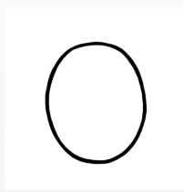
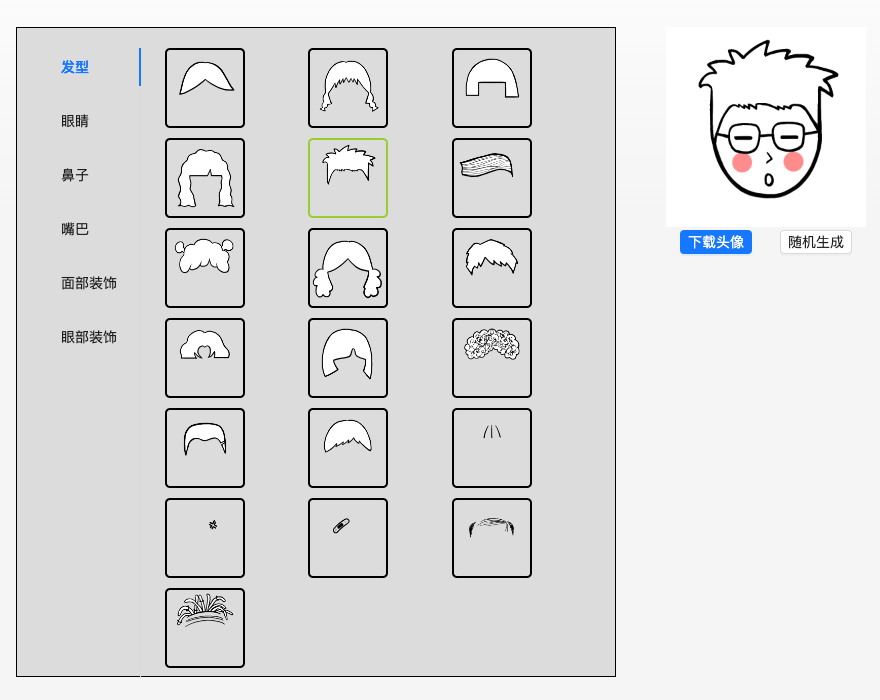

## 背景

> 一句话，用 `canvas.drawImage` 实现头像拼接，图片增加装饰，获取图片点击处颜色等功能；

### 项目背景


在玩蛋仔派对的时候，觉得换肤很有意思。在逛开源社区的时候，看到了用 `canvas.drawImage` 实现同样效果的项目（[gclx-official](https://github.com/lxdao-official/gclx-official)）。

继续逛下去发现有很多场景的实现原理都是相同的。

头像增加挂饰

### drawImage

drawImage 可以将图片绘制到画布上面。

#### api 介绍

重载了三种函数入参，可以设置图片的宽高和对原始图片的裁剪。

```js
//在画布上定位图像：
drawImage(image, dx, dy);
// 在画布上定位图像，并规定图像的宽度和高度：
drawImage(image, dx, dy, dWidth, dHeight);
//剪切图像，并在画布上定位被剪切的部分：
drawImage(image, sx, sy, sWidth, sHeight, dx, dy, dWidth, dHeight);
```

#### 一个最简单的 demo

先创建一个 image 元素

```js
const loadImage = (src: string) =>
  new Promise((resolve, reject) => {
    const img = new Image();
    img.onload = () => resolve(img);
    img.onerror = reject;
    img.src = src;
  });
```

在图片加载好以后，将调用 drawImage 函数，将图片绘制到画布中

```js
ctx?.drawImage(item, 0, 0, 200, 200);
```

 一张图片就被画到画布上面了。

## 拼接头像

体验地址：[头像拼接](https://mamumu123.github.io/img-generate/) 

如果要实现拼接头像的功能，就是将几张图片叠加绘制到画布上去。

### 核心代码

核心代码就两行

1. 加载需要的图片
2. 将图片绘制到画布中

```js
const imagesObj = await Promise.all(images.map(loadImage));
imagesObj.forEach((item) => {
  ctx?.drawImage(item, 0, 0, 200, 200);
});
```

其他的就是一些细节的调整，比如发型要放到画布最下面；每次渲染的时候需要清理一下画布等。

## 参考地址

[HTML canvas drawImage() 方法](https://www.runoob.com/tags/canvas-drawimage.html)
