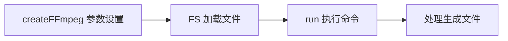
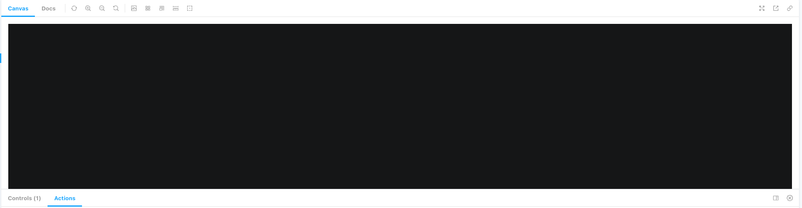
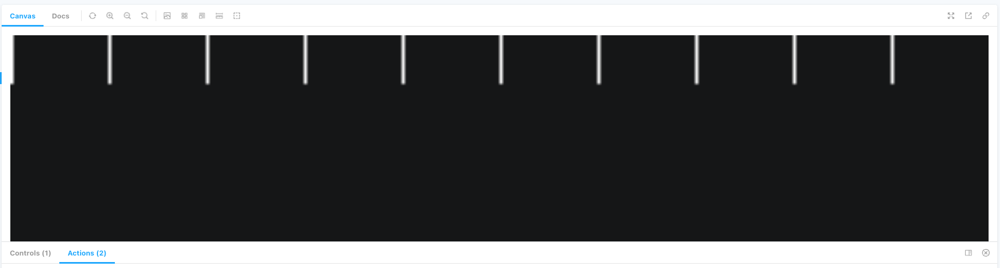
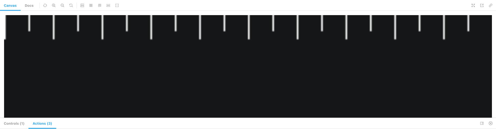
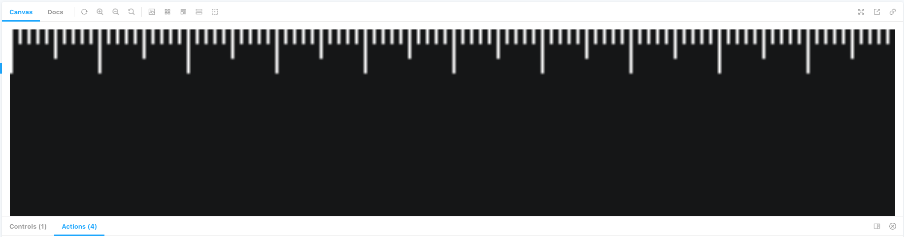
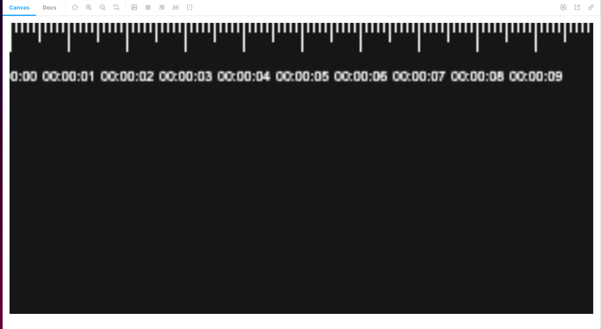
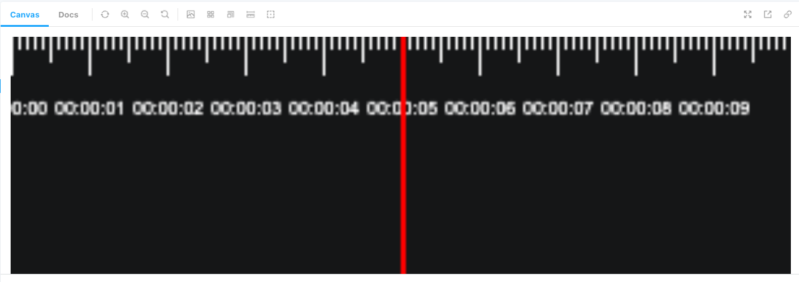
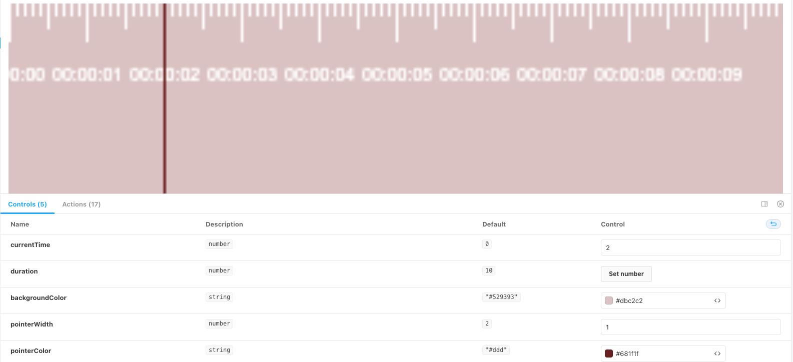
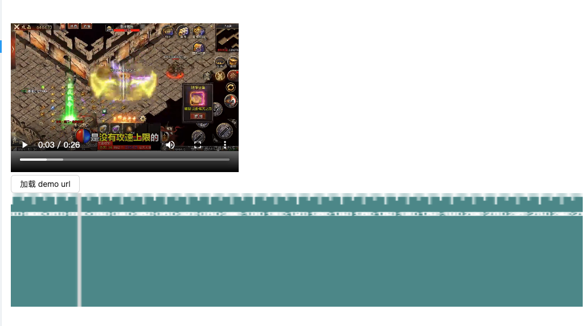

# 从零开始用 ffmpeg 写一个音视频处理工具

## 概述 
本文作为一个文档，如何写一个在线音视频编辑工具。
- 如何在 浏览器运行 ffmpeg 处理文件。
- 实现一个视频轨道
- 结合轨道和 ffmpeg,实现视频可视化，增加轨道

## 关键词
ffmpeg、track、音视频

## 项目背景

### 项目制作原因
在工作和生活中，经常会遇到一些和音视频相关的问题，比如：
- 想要从一个视频中截图一张图片
- 想要从一个长音频中截取某个特定的片段
- 格式转化，从视频中提取音频
- ...

### 工具库介绍 -> ffmpeg
ffmpeg 是一个很不错的音视频处理工具。并且靠着 wasm 技术，能够在浏览器端直接运行，不需要本地安装下载。

### @ffmpeg/ffmpeg
npm 地址: https://www.npmjs.com/package/@ffmpeg/ffmpeg
这是一个编译好的包。缺点是比较大，第一次加载的时候需要等待几秒钟；优点就是可以直接拿来用。
这里我们直接引用这个包，等之后需要优化的时候，再去考虑自行编译或者寻找更合适的包。

#### api 介绍
直接看一个官方给的 demo，通过几行脚本，就可以完成一个格式转换的任务。
```js
import { writeFile } from 'fs/promises';
import { createFFmpeg, fetchFile } from '@ffmpeg/ffmpeg';

// 设置参数
const ffmpeg = createFFmpeg({ log: true });

(async () => {
  // 加载 ffmpeg.wasm-core 脚本
  await ffmpeg.load();

  // 输入文件需要调用 FS 方法，这样 ffmpeg 才能够进行”消费“
  ffmpeg.FS('writeFile', 'test.avi', await fetchFile('./test.avi'));

  // 执行 ffmpeg 命令
  await ffmpeg.run('-i', 'test.avi', 'test.mp4');
  
  // node 端将生成的文件直接写到文件中
  await fs.promises.writeFile('./test.mp4', ffmpeg.FS('readFile', 'test.mp4'));
  process.exit(0);
})();
```

大概流程如下图


## 动手试试-在浏览器使用 ffmpeg

### 初始化项目
我这里使用的是 umi，通过以下命令就可以进行初始化
```bash
# 新建文件夹
mkdir myapp && cd myapp
# 初始化项目
yarn create @umijs/umi-app
# 安装依赖
yarn start
```

在执行完上面的步骤以后，浏览器端就可以看到效果了。


### 引入 @ffmpeg/ffmpeg 
安装包很简单，通过 `npm i @ffmpeg/ffmpeg`  就可以了，但是在引入的过程中，遇到了一些问题。

#### 问题一： Module parse failed: Unexpected token
webpack4 
```bash
ERROR in ./node_modules/@ffmpeg/ffmpeg/src/browser/defaultOptions.js 7:68
Module parse failed: Unexpected token (7:68)
You may need an appropriate loader to handle this file type, currently no loaders are configured to process this file. See https://webpack.js.org/concepts#loaders
|  */
| const corePath = typeof process !== 'undefined' && process.env.NODE_ENV === 'development'
>   ? new URL('/node_modules/@ffmpeg/core/dist/ffmpeg-core.js', import.meta.url).href
|   : `https://unpkg.com/@ffmpeg/core@${devDependencies['@ffmpeg/core'].substring(1)}/dist/ffmpeg-core.js`;
| 
 @ ./node_modules/@ffmpeg/ffmpeg/src/browser/index.js 1:23-50
 @ ./node_modules/@ffmpeg/ffmpeg/src/index.js
 @ ./src/pages/index.tsx
 @ ./src/.umi/core/routes.ts
 @ ./src/.umi/umi.ts
 @ multi ./node_modules/umi/node_modules/@umijs/preset-built-in/bundled/@pmmmwh/react-refresh-webpack-plugin/client/ReactRefreshEntry.js ./src/.umi/umi.ts
```

##### 解决方案一：更换导入方式
```js
import { createFFmpeg, fetchFile } from '@ffmpeg/ffmpeg';
```
改为
```js
import { createFFmpeg, fetchFile } from '@ffmpeg/ffmpeg/dist/ffmpeg.min.js';
```
这时类型会丢失，强行设置一下就好
```js
import { FFmpeg } from '@ffmpeg/ffmpeg';

const ffmpeg = createFFmpeg({
  ...
}) as FFmpeg;
```
##### 解决方案二：切换为 webpack 5
`umi` 切换 `webpack 5` 比较简单，直接在 `.umirc` 配置一下就好
```js
  webpack5: {}
```

然后将 core 文件放在 public 下，并且在 createFFmpeg 时设置参数。
```js
const ffmpeg = createFFmpeg({
  ...
  corePath: `${location.origin}/static/v0.11.0/ffmpeg-core.js`,
});
```

#### 问题二：SharedArrayBuffer is not defined

问题原因是 ffmpeg 使用到了 [SharedArrayBuffer](https://developer.mozilla.org/en-US/docs/Web/JavaScript/Reference/Global_Objects/SharedArrayBuffer)， 但是 SharedArrayBuffer 由于安全问题，会有一些限制。如果要在页面中使用 SharedArrayBuffer，需要设置页面为跨域隔离；或者设置 token 令牌作为临时方案。（具体原因[前端的 FFmpeg? 可能还没准备好](https://juejin.cn/post/7150962372130111518)介绍的比较详细，可以参考）

##### 解决方案： 设置跨域隔离
通过在页面中设置两个请求头，可以设置 CORP

``` bash
Cross-Origin-Embedder-Policy: require-corp
Cross-Origin-Opener-Policy: same-origin
```

在开发中，通过设置 devServer，可以解决问题。
``` js
  devServer: {
    headers: {
      'Cross-Origin-Opener-Policy': 'same-origin',
      'Cross-Origin-Embedder-Policy': 'require-corp',
    },
  },
```

### 梳理步骤，跑通基本流程
在顺序引入 @ffmpeg/ffmpeg 包以后，就可以开发功能了。
按照功能优先的原则，觉得先把功能跑通，后面再优化流程和 UI。
参考了网上几个 `ffmpeg` 的 demo, 然后整理了一个比较舒服的流程。


#### 上传需处理文件
获取需上传文件，然后调用 FS 方法
```tsx
const props = {
  ...,
  beforeUpload: async (file) => {
      const { name, size, type } = file;
      ffmpeg.FS('writeFile', name, await fetchFile(file));
      ...
      setOpInput(name);
      return false;
    },
}
...
<Upload {...props}>
  <Button icon={<UploadOutlined />}>选择文件</Button>
</Upload>
```


#### 执行命令
在输入参数，输出文件参数，执行脚本参数都填写完成以后，就可以点击进行运行了
``` tsx
await ffmpeg.run(...allArgs.split(' '));
```

看一下效果，是没问题的


### 增加一点优化
ffmpeg 命令其实是比较难记的，让用户去记录或者自行查找并不友好。
所以预期是将一些比较常用的命令全部记录一下，让用户可以直接选择。
```ts
export const getOp = (op: string, args?: IGetOp) => {
  const { timer } = args || {};
  let output = '';
  let resultOp = '';
  switch (op) {
    // 截图
    case OP_NAME.screenshot:
      resultOp = `-ss ${timer}  -vframes 1`;
      output = 'out.png';
      break;
      
    // 从视频中抽出音频
    case OP_NAME.getMp3FromVideo:
      resultOp = ` -f mp3 -vn`;
      output = 'out.mp3';
      break;
    
    // 获取视频信息
    case OP_NAME.getInfo:
      resultOp = '';

      break;
    default:
      resultOp = DEFAULT_ARGS;
      output = OUT_DEFAULT;
  }
  return [resultOp, output];
};
```
效果如下图


### 体验地址
TODO


## 实现视频轨道
参考项目 [shWave](https://github.com/Shirtiny/shWave)，实现一个超级简单的轨道 demo, 为后面实现 mini 剪辑器做基础。改造点：

## 开始代码
### 整体分析
将轨道拆分的话，分为
- 背景
- 刻度尺
- 时间指针（指向当前视频播放的时刻）


### 静态实现

####  canvas 架子
轨道是 canvas 实现的，所以首先要在页面添加一个 
```js
<canvas
    ref={$canvas}
    id="shcanvas"
    style={{
        height: '100%',
        width: '100%',
        zIndex: 0,
        pointerEvents: 'auto',
    }}
></canvas>
```

然后在获取到 canvas 以后，开始进行轨道的绘制
``` js
useEffect(() => {
    if (!waveCanvas) { return }
    draw?.()
}, [waveCanvas, draw, currentTime, duration]);
 // 各种场景都有可能触发重新绘制
```

` draw ` 函数中，分别对提到的三个元素进行绘制。

```js
const draw = () => {
    const ctx = waveCanvas && waveCanvas?.getContext("2d");
    if (!waveCanvas || !ctx) return;

    //像素比
    const pixelRatio = window.devicePixelRatio;

    //绘制背景
    drawBackground(waveCanvas, ctx, backgroundColor);

    // 刻度尺
    drawRuler(waveCanvas, ctx, pixelRatio, duration)

    // 时间指针
    drawPointer({
        canvas: waveCanvas,
        ctx,
        pixelRatio,
        duration,
        currentTime,
        color: pointerColor,
        pointerWidth,
    })
}
```

##### 绘制背景（drawBackground）
```js
export const drawBackground = (canvas: HTMLCanvasElement, ctx: CanvasRenderingContext2D, backgroundColor = "#529393") => {
    if (!canvas || !ctx) return;
    const { width, height } = canvas;
    //清空一个矩形 (清空上一个背景)
    ctx.clearRect(0, 0, width, height);
    //设置填充绘画的颜色
    ctx.fillStyle = backgroundColor;
    //填充出一个矩形 （绘制背景）
    ctx.fillRect(0, 0, width, height);
};
```

效果展示


##### 绘制刻度尺
刻度尺就是循环遍历，然后绘制长短不一的小矩形
- 整秒 最长
- 0.5 秒，次之
- 0.1 秒，最短
然后在整秒刻度下面，会有文字显示

###### 整秒
length 是需要的`秒长度 * 10`，然后进行遍历，每 10 * 0.1 时，绘制最长的矩形。
其中，每次遍历，变化的就是 x 的位置，其他的参数都是不变的。
``` js
for (let index = 0; index < length; index += 1) {
        //十格间距
        if (index % 10 === 0) {
            // x , y , w, h
            ctx.fillRect(
            index * gap, 
            0, 
            pixelRatio, 
            fontHeight * pixelRatio);
        }
}
```



###### 0.5 秒
其他都不变，只是长度变了。
```js
else if (index % 5 === 0) {
    ctx.fillRect(index * gap, 0, pixelRatio, (fontHeight * pixelRatio) / 1.5);
}
```



###### 0.1 秒
同样，只是长度变得更短了。

```js
else {
    ctx.fillRect(index * gap, 0, pixelRatio, (fontHeight * pixelRatio) / 3);
}
```



duration 文字展示
文字，就是现实对应的时刻 ，`时刻 = begin + second`
```js
if (index % 10 === 0) {
    second += 1;

    ctx.fillText(
        // text x y maxWidth
        // time = 开始时间 + 遍历到的秒数
        durationToTime(begin + second).split(".")[0], // s
        gap * index - fontSize * pixelRatio * 2 + pixelRatio, // x
        fontTop * pixelRatio // y
    );
}
```



##### 时间线（timer)
时间刻度线其实就是一个矩形，指示这当前视频播放的时刻吗，也就是 currentTime 对应的时间刻度。

```js
const { width, height } = canvas;
ctx.fillStyle = color
const length = getLength(duration);

// 每 0.1 s 所对应的像素宽度。
const gap = getGap(width, length)

// 开始点
const begin = getBegin(currentTime, duration);

ctx.fillRect(
    Number(((currentTime - begin) * 10 * gap).toFixed(3)), // x
    0,  // y
    pointerWidth * pixelRatio, // width
    height, // height
)
```


做到这里，一个静态时间轴的效果就已经有了。

### 参数传递

接下来，我们将变量全部通过参数的形式传递进来，这样子就可以让时间轴动起来。
这里，我们通过 storybook 来查看实时效果。
```js
  argTypes: {
    currentTime: {
      control: {
        type: 'number',
      },
    },
    duration: {
      control: {
        type: 'number',
      },
    },
    backgroundColor: {
      control: {
        type: 'color',
      },
    },
    pointerWidth: {
      control: {
        type: 'number',
      },
    },
    pointerColor: {
      control: {
        type: 'color',
      },
     },
  },
```

效果如图，在下方修改入参，上方会看到实时效果。



### 事件响应

#### 缩放条
shwave 的方式通过调整 duration，这个其实不太科学，比如有一个问题，就是放大的时候，无法看到后面的 duration ，只能放大前面的 duration
应该是加入一个缩放比变量更合适。
缩放比 + 滚动条。

#### 轨道点击
当进行轨道点击以后，需要进行计算点到的对应时刻，然后重新设置 currentTime

首先进行 canvas 的监听
```js
useEffect(() => {
  if (waveCanvas === null) {
      return
  }
  //设置canvas点击监听
  waveCanvas.addEventListener("click", onCanavsClick);
  return () => {
      waveCanvas.removeEventListener("click", onCanavsClick);
  }
}, [waveCanvas])
```

在监听到事件点击以后，直接计算对应时刻， 进行设置就好。
```js
const onCanavsClick = (event: MouseEvent) => {
    const time = computeTimeFromEvent(event);
    if (currentTime !== time) {
        click?.(time);
        draw();
    }
};
```

偏移时刻是如何计算的呢

- 每一个所占的像素大小
- 计算点击位置距离左侧的偏移大小
- 根据偏移量，计算在时间轴中对应的时刻


```js
const computeTimeFromEvent = (event: MouseEvent) => {
    if (!waveCanvas || !$shwave.current) {
        return 0
    }
    const { clientWidth: width } = waveCanvas;// canvas 实际宽度
    const pixelRatio = window.devicePixelRatio; // 1
    const length = getLength(duration); // 100
    const gap = getGap(width, length); // 0.1 s 所占用的像素 宽度

    // 偏移的宽度
    const left = event.pageX - $shwave.current.offsetLeft / pixelRatio;

    const begin = getBegin(currentTime, duration);

    // left 在 时间中的位置
    const time = clamp(
        ((left / gap) * pixelRatio) / 10 + begin,
        begin,
        begin + duration
    );

    return time;
}
```


### 播放器

播放器这里就是一个 video 元素，然后监听一些 video 的事件，在播放时进行 currentTime 的设置；

轨道  -> 点击轨道 -> 设置播放器的 currentTime -> 设置轨道的  currentTime

点击播放视频 -> 播放器 currentTime 变化 -> 轨道时间刻度线跟随变化

#### 
首先在界面中放置一个 video 元素
```js
const videoRef = useRef<HTMLVideoElement | null>(null)

<video controls width={400} height={300} src={url} ref={videoRef}></video>

```

然后进行监听,在 `canplay` 事件中设置 duration ,在 `ontimeupdate` 中设置 currentTime。 
```js
useEffect(() => {
    if (!videoRef.current) {
        return
    }
    videoRef.current.ontimeupdate = () => {
        setCurrentTime?.(videoRef.current?.currentTime)
    }
    videoRef.current.addEventListener('canplay', () => {
        setDuration?.(videoRef.current?.duration)
    })
}, [url])
```


## 基本效果展示



## 参考
[前端的 FFmpeg? 可能还没准备好](https://juejin.cn/post/7150962372130111518)

[借助ffmpeg.wasm纯前端实现多音频和视频的合成](https://www.zhangxinxu.com/wordpress/2021/03/ffmpeg-wasm-audio-video-merge/)

[前端视频帧提取 ffmpeg + Webassembly](https://juejin.cn/post/6854573219454844935)

### 项目参考
https://github.com/cs8425/ffmpeg-cli-online

https://github.com/xiguaxigua/ffmpeg-online