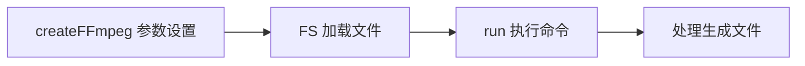
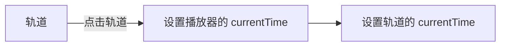
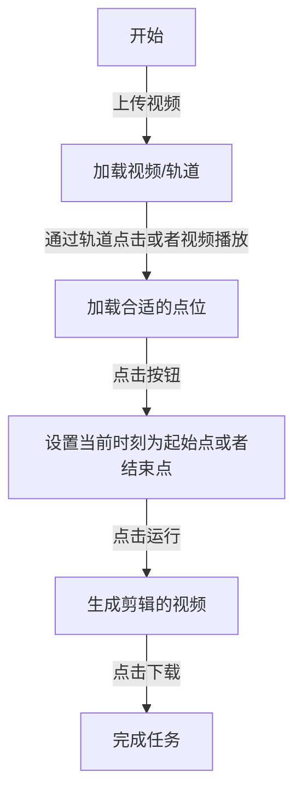

## 概述

本文将介绍如何用 ffmpeg + canvas 写一个在线可视化音视频编辑工具:

*   如何在浏览器运行 ffmpeg 处理音视频；
*   如何用 canvas 实现一个视频轨道;
*   如何结合轨道、播放器和 ffmpeg, 实现视频编辑可视化；

## 关键词

ffmpeg、video、轨道、可视化、canvas

## 效果截图


## 体验地址
[videoCut](https://img-generate-six.vercel.app/videoCut/videoCut)(部署在 vercel， 需科学上网）

## 代码仓库

[img-generate
](https://github.com/mamumu123/img-generate)(都点进去了，帮我点个免费的 star 吧🥰)

## 项目背景

### 项目制作原因

在工作和生活中，经常会遇到一些音视频相关的问题，比如：

*   想要从一个视频中截图一张图片；
*   想要从一个长视频中截取某个特定的片段；
*   格式转化，从视频中提取音频；
*   获取视频信息，如帧率；
*   ...

如果在本地分析，得先配置环境，安装 ffmpeg 等分析工具，需要比较多的准备工作。而如果使用 wasm 技术，在浏览器端直接运行 ffmpeg，不需要本地安装下载，对小白用户会更加友好。

## 动手试试-在浏览器使用 ffmpeg

### @ffmpeg/ffmpeg

[npm 地址](https://www.npmjs.com/package/@ffmpeg/ffmpeg)

这是一个编译好的包。缺点是比较大，第一次加载的时候需要等待几秒钟；优点就是可以直接拿来用。
这里我们直接引用这个包，等之后需要优化的时候，再去考虑自行编译或者寻找更合适的包。

#### api 介绍

直接看一个官方给的 demo，通过几行脚本，就可以完成一个格式转换的任务。

```js
import { writeFile } from 'fs/promises';
import { createFFmpeg, fetchFile } from '@ffmpeg/ffmpeg';

// 设置参数
const ffmpeg = createFFmpeg({ log: true });

(async () => {
  // 加载 ffmpeg.wasm-core 脚本
  await ffmpeg.load();

  // 输入文件需要调用 FS 方法，这样 ffmpeg 才能够进行”消费“
  ffmpeg.FS('writeFile', 'test.avi', await fetchFile('./test.avi'));

  // 执行 ffmpeg 命令
  await ffmpeg.run('-i', 'test.avi', 'test.mp4');
  
  // node 端将生成的文件直接写到文件中
  await fs.promises.writeFile('./test.mp4', ffmpeg.FS('readFile', 'test.mp4'));
  process.exit(0);
})();
```

大概流程如下图



### 初始化项目

我这里使用的是 umi，通过以下命令就可以进行初始化

```bash
# 新建文件夹
mkdir myapp && cd myapp
# 初始化项目
yarn create @umijs/umi-app
# 安装依赖
yarn start
```

在执行完上面的步骤以后，浏览器端就可以看到页面效果了。

### 引入 @ffmpeg/ffmpeg

安装包很简单，通过 `npm i @ffmpeg/ffmpeg`  就可以了，但是在引入的过程中，本人遇到了一些问题。

#### 问题一： Module parse failed: Unexpected token

webpack4

```bash
ERROR in ./node_modules/@ffmpeg/ffmpeg/src/browser/defaultOptions.js 7:68
Module parse failed: Unexpected token (7:68)
You may need an appropriate loader to handle this file type, currently no loaders are configured to process this file. See https://webpack.js.org/concepts#loaders
|  */
| const corePath = typeof process !== 'undefined' && process.env.NODE_ENV === 'development'
>   ? new URL('/node_modules/@ffmpeg/core/dist/ffmpeg-core.js', import.meta.url).href
|   : `https://unpkg.com/@ffmpeg/core@${devDependencies['@ffmpeg/core'].substring(1)}/dist/ffmpeg-core.js`;
| 
 @ ./node_modules/@ffmpeg/ffmpeg/src/browser/index.js 1:23-50
 @ ./node_modules/@ffmpeg/ffmpeg/src/index.js
 @ ./src/pages/index.tsx
 @ ./src/.umi/core/routes.ts
 @ ./src/.umi/umi.ts
 @ multi ./node_modules/umi/node_modules/@umijs/preset-built-in/bundled/@pmmmwh/react-refresh-webpack-plugin/client/ReactRefreshEntry.js ./src/.umi/umi.ts
```

##### 解决方案一：更换导入方式

```js
import { createFFmpeg, fetchFile } from '@ffmpeg/ffmpeg';
```

改为

```js
import { createFFmpeg, fetchFile } from '@ffmpeg/ffmpeg/dist/ffmpeg.min.js';
```

这时类型会丢失，强行设置一下就好

```js
import { FFmpeg } from '@ffmpeg/ffmpeg';

const ffmpeg = createFFmpeg({
  ...
}) as FFmpeg;
```

##### 解决方案二：切换为 webpack 5

`umi` 切换 `webpack 5` 比较简单，直接在 `.umirc` 配置一下就好

```js
  webpack5: {}
```

然后将 core 文件放在 public 下，并且在 createFFmpeg 时设置参数。

```js
const ffmpeg = createFFmpeg({
  ...
  corePath: `${location.origin}/static/v0.11.0/ffmpeg-core.js`,
});
```

#### 问题二：SharedArrayBuffer is not defined

问题原因是 ffmpeg 使用到了 [SharedArrayBuffer](https://developer.mozilla.org/en-US/docs/Web/JavaScript/Reference/Global_Objects/SharedArrayBuffer)， 但是 SharedArrayBuffer 由于安全问题，会有一些限制。如果要在页面中使用 SharedArrayBuffer，需要设置页面为跨域隔离；或者设置 token 令牌作为临时方案。（具体原因[前端的 FFmpeg? 可能还没准备好](https://juejin.cn/post/7150962372130111518)介绍的比较详细，可以参考）

##### 解决方案： 设置跨域隔离

通过在页面中设置两个请求头，可以设置 CORP

```bash
Cross-Origin-Embedder-Policy: require-corp
Cross-Origin-Opener-Policy: same-origin
```

在开发中，通过设置 devServer，可以解决问题。

```js
  devServer: {
    headers: {
      'Cross-Origin-Opener-Policy': 'same-origin',
      'Cross-Origin-Embedder-Policy': 'require-corp',
    },
  },
```

### 梳理步骤，跑通基本流程

在顺利引入 `@ffmpeg/ffmpeg` 包以后，就可以开始开发功能了。按照功能优先的原则，先把功能跑通，后面再优化流程和 UI。

参考了几个 `浏览器 ffmpeg` 的 demo, 整理了一个比较舒服的流程。


#### 上传需处理文件

获取需上传文件，然后调用 FS 方法

```tsx
const props = {
  ...,
  beforeUpload: async (file) => {
      const { name, size, type } = file;
      ffmpeg.FS('writeFile', name, await fetchFile(file));
      ...
      setOpInput(name);
      return false;
    },
}
...
<Upload {...props}>
  <Button icon={<UploadOutlined />}>选择文件</Button>
</Upload>
```

#### 执行命令

在`输入`，`输出文件`，`执行脚本`等参数都填写完成以后，就可以合并参数，运行 `ffmpeg 命令`, 获得输出结果了。

```tsx
await ffmpeg.run(...allArgs.split(' '));
```

看一下效果，是没问题的


### 增加一点优化

ffmpeg 命令其实是比较难记的，让用户自行查找并不友好。
所以预期是将一些比较常用的命令全部记录一下，让用户可以直接选择。

```ts
export const getOp = (op: string, args?: IGetOp) => {
  // const { out = OUT_DEFAULT, input = IN_DEFAULT, timer } = args || {}
  let output = '';
  let resultOp = '';
  const { rangeLeft, rangeRight, input, out, timer } = args || {};

  switch (op) {
    case OP_NAME.screenshot:
      resultOp = `-i ${input} -ss ${timer}  -vframes 1 ${out}`;
      output = 'out.png';
      break;

    case OP_NAME.getMp3FromVideo:
      resultOp = ` -f mp3 -vn`;
      output = 'out.mp3';
      break;

    case OP_NAME.getInfo:
      resultOp = '';
      output = OUT_DEFAULT;
      break;

    case OP_NAME.custom:
      resultOp = '';
      output = OUT_DEFAULT;
      break;

    case OP_NAME.cutVideo:
      resultOp = `-ss ${rangeLeft} -to ${rangeRight} -i ${input} -c:v copy -c:a copy ${out}`;
      output = OUT_DEFAULT;
      break;

    default:
      resultOp = DEFAULT_ARGS;
      output = OUT_DEFAULT;
  }
  return [resultOp, output];
};
```

效果如下图


### 体验地址

[ffmpeg](https://img-generate-six.vercel.app/videoCut/ffmpeg)(部署在 vercel， 需科学上网）

## 视频轨道（可视化的音视频分割）

为了实现`可视化的音视频分割`，需要实现一个轨道和播放器。通过轨道来精细化的设置分割点位，通过播放器实时看到点位的视频效果。这里参考了开源项目 [shWave](https://github.com/Shirtiny/shWave)，实现了一个简单的轨道。

### 整体分析

将轨道拆分的话，分为:

*   背景
*   刻度尺
*   时间指针（指向当前视频播放的时刻）

然后我们按照`静态部分 -> 动态部分（参数传递） -> 动态部分（事件响应、缩放条） `的顺序进行实现。

### 静态部分实现

#### 添加画布到页面

轨道是 canvas 实现的，所以首先要在页面添加一个画布

```js
<canvas
    ref={$canvas}
    id="shcanvas"
    style={{
        height: '100%',
        width: '100%',
        zIndex: 0,
        pointerEvents: 'auto',
    }}
></canvas>
```

在 canvas 加载完成以后，开始进行轨道的绘制

```js
useEffect(() => {
    if (!waveCanvas) { return }
    draw?.()
}, [waveCanvas, draw, currentTime, duration]);
 // 各种场景都有可能触发重新绘制
```

`draw` 函数中，分别对提到的三个元素（背景、刻度尺、时间指针）进行绘制。

```js
const draw = () => {
    const ctx = waveCanvas && waveCanvas?.getContext("2d");
    if (!waveCanvas || !ctx) return;

    //绘制背景
    drawBackground(waveCanvas, ctx, backgroundColor);

    // 刻度尺
    drawRuler(waveCanvas, ctx, 1, duration)

    // 时间指针
    drawPointer({
        canvas: waveCanvas,
        ctx,
        pixelRatio: 1,
        duration,
        currentTime,
        color: pointerColor,
        pointerWidth,
    })
}
```

##### 绘制背景（drawBackground）

```js
export const drawBackground = (canvas: HTMLCanvasElement, ctx: CanvasRenderingContext2D, backgroundColor = "#529393") => {
    if (!canvas || !ctx) return;
    const { width, height } = canvas;
    //清空上一次渲染
    ctx.clearRect(0, 0, width, height);
    //设置填充绘画的颜色
    ctx.fillStyle = backgroundColor;
    //填充出一个矩形 （绘制背景）
    ctx.fillRect(0, 0, width, height);
};
```

效果展示


##### 绘制刻度尺

刻度尺就是循环遍历，然后绘制长短不一的小矩形,然后在整秒刻度下面，会有文字显示:

*   整秒，最长;
*   0.5 秒，次之;
*   0.1 秒，最短;

###### 整秒

length 是需要的`秒长度 * 10`，然后进行遍历，每 10 \* 0.1 时，绘制最长的矩形。
其中，每次遍历，变化的就是 x 的位置，其他的参数都是不变的。

```js
for (let index = 0; index < length; index += 1) {
        //十格间距
        if (index % 10 === 0) {
            // x , y , w, h
            ctx.fillRect(
            index * gap, 
            0, 
            pixelRatio, 
            fontHeight * pixelRatio);
        }
}
```


###### 0.5 秒

其他都不变，只是长度变了。

```js
else if (index % 5 === 0) {
    ctx.fillRect(index * gap, 0, pixelRatio, (fontHeight * pixelRatio) / 1.5);
}
```


###### 0.1 秒

同样，只是长度变得更短了。

```js
else {
    ctx.fillRect(index * gap, 0, pixelRatio, (fontHeight * pixelRatio) / 3);
}
```


duration 文字展示
文字，就是现实对应的时刻 ，`时刻 = begin + second`

```js
if (index % 10 === 0) {
    second += 1;

    ctx.fillText(
        // text x y maxWidth
        // time = 开始时间 + 遍历到的秒数
        durationToTime(begin + second).split(".")[0], // s
        gap * index - fontSize * pixelRatio * 2 + pixelRatio, // x
        fontTop * pixelRatio // y
    );
}
```


##### 时间线（timer)

时间刻度线其实就是一个矩形，指示着当前视频播放的时刻，也就是 currentTime 对应的时间刻度。

```js
const { width, height } = canvas;

const length = getLength(duration);

// 每 0.1 s 所对应的像素宽度。
const gap = getGap(width, length)

// 开始点
const begin = getBegin(currentTime, duration);

ctx.fillRect(
    Number(((currentTime - begin) * 10 * gap).toFixed(3)), // x
    0,  // y
    pointerWidth * pixelRatio, // width
    height, // height
)
```


做到这里，一个静态时间轴的效果就已经有了。

### 参数传递

接下来，我们将变量全部通过参数的形式传递进来，这样子就可以让时间轴动起来。
这里，我们通过 `storybook` 来查看实时效果。

```js
  argTypes: {
    currentTime: {
      control: {
        type: 'number',
      },
    },
    duration: {
      control: {
        type: 'number',
      },
    },
    backgroundColor: {
      control: {
        type: 'color',
      },
    },
    pointerWidth: {
      control: {
        type: 'number',
      },
    },
    pointerColor: {
      control: {
        type: 'color',
      },
     },
  },
```

效果如图，在下方修改入参，上方会看到实时效果。


### 事件响应

#### 缩放条

shwave 是通过调整 duration来进行缩放的。这个方案有一个问题，就是放大的时候，无法看到后面的 duration ，只能放大前面的 duration。
我认为更加合适的方式应该是增加一个缩放比的字段，来控制轨道的长度。在下方增加一个滚动条，当放到轨道以后，可以通过滚动来查看后面的时间。

用 Slider + InputNumber 实现一个可以拖拽，可以输入的缩放条。

```js
  <Col span={5}>
      <Slider
          min={1}
          max={20}
          onChange={(value: number) => setRatio(value)}
          value={ratio}
          step={0.1} />
  </Col>
  <Col span={8}>
      <InputNumber
          min={1}
          max={20}
          style={{ margin: '0 16px' }}
          step={0.1}
          value={ratio}
          onChange={(value: number | null) => setRatio(value || 1)}
      />
  </Col>

```


#### 轨道点击

当进行轨道点击以后，需要计算点到的对应时刻，然后重新设置 currentTime

首先进行 canvas 的监听

```js
useEffect(() => {
  if (waveCanvas === null) {
      return
  }
  //设置canvas点击监听
  waveCanvas.addEventListener("click", onCanavsClick);
  return () => {
      waveCanvas.removeEventListener("click", onCanavsClick);
  }
}, [waveCanvas])
```

在监听到事件点击以后，直接计算对应时刻，进行设置就好。

```js
const onCanavsClick = (event: MouseEvent) => {
    const time = computeTimeFromEvent(event);
    if (currentTime !== time) {
        click?.(time);
    }
};
```

偏移时刻是计算步骤：

*   计算每一个所占的像素大小；
*   计算点击位置距离左侧的偏移大小；
*   根据偏移量，计算在时间轴中对应的时刻；

```js
const computeTimeFromEvent = (event: MouseEvent) => {
    if (!waveCanvas || !$shwave.current) {
        return 0
    }
    const { clientWidth: width } = waveCanvas;// canvas 实际宽度
    const pixelRatio = window.devicePixelRatio; // 1
    const length = getLength(duration); // 100
    const gap = getGap(width, length); // 0.1 s 所占用的像素 宽度

    // 偏移的宽度
    const left = event.pageX - $shwave.current.offsetLeft / pixelRatio;

    const begin = getBegin(currentTime, duration);

    // left 在 时间中的位置
    const time = clamp(
        ((left / gap) * pixelRatio) / 10 + begin,
        begin,
        begin + duration
    );

    return time;
}
```

### 播放器

在实现完轨道以后，还要实现一个视频播放器，来实时看到点位的视频效果。

播放器这里就是一个 video 元素，为了实现轨道和播放器的联动，需要监听一些 video 的事件，在播放时进行 currentTime 的设置；




#### 设置 video

首先在界面中放置一个 video 元素

```js
const videoRef = useRef<HTMLVideoElement | null>(null)

<video controls width={400} height={300} src={url} ref={videoRef}></video>

```

然后进行监听,在 `canplay` 事件中设置 duration ,在 `ontimeupdate` 中设置 currentTime。

```js
useEffect(() => {
    if (!videoRef.current) {
        return
    }
    videoRef.current.ontimeupdate = () => {
        setCurrentTime?.(videoRef.current?.currentTime)
    }
    videoRef.current.addEventListener('canplay', () => {
        setDuration?.(videoRef.current?.duration)
    })
}, [url])
```

#### 基本效果展示


## 可视化视频剪辑

在 ffmpeg 运行在浏览器、轨道和播放器联动两件事情做完以后，我们就可以实现可视化视频剪辑的功能了。

### 视频分割

ffmpeg 命令中，实现剪辑功能需要提供起始点时间和结束点时间。

```bash
ffmpeg -ss 00:17:24  -to 02:19:31 -i inputVideo.mp4 -c:v copy -c:a copy outputVideo.mp4
```

所以一个完整的流程应该是这样子的：



效果截图


### 视频截图

在将视频播放到指定位置以后，我们可以通过执行`ffmpeg` 命令进行视频截图，

```bash
ffmpeg -i ${input} -ss ${timer}  -vframes 1 ${out}
```

效果截图


## 其他细节点

### 本地保存上传文件
在上传文件以后，如果刷新页面，上传的文件就会丢失，所以增加一个本地缓存是有必要的。这样子在误刷新页面以后，还是能够拿到之前上传的文件。存储文件选择的是 indexDb，因为存储空间足够大。 而平时更多使用的 localStorage存储空间则比较小， 最大存储空间只有 5M。

#### 初始化
在 react 项目中，有一些现成的库可以直接使用，其中使用量最多的就是 `dexie`。
我们首先引入 dexie， 进行数据库表的定义。

```ts
// db.ts
import Dexie, { Table } from 'dexie';

export interface FileData {
    id?: number;
    name: string;
    type: string;
    data: File;
}

export class FileDexie extends Dexie {

    files!: Table<FileData>;


    constructor() {
        super('myDatabase');
        this.version(1).stores({
            files: '++id, name, type, data' // Primary key and indexed props
        });
    }
}

export const dbFileDexie = new FileDexie();
```


#### 保存上传文件
在 indexDb 初始化完成以后，我们开始上传文件，然后在上传组件的 `onChange`函数中调用`db.files.put`函数，就可以将文件存到 indexDb 中。
```tsx
    const handleMediaChange = (event: React.ChangeEvent<HTMLInputElement>) => {
        const file = event.target.files?.[0];
        if (file) {
            try {
                const { name } = file;
                db.files.put({ name, type: file.type, data: file })
            } catch (error) {
                console.error('handleMediaChange error', error)
            }
        };
    }
    
 <input type="file" onChange={handleMediaChange} />
```

使用的地方，则调用 useLiveQuery 进行查询。

```js
import { useLiveQuery } from 'dexie-react-hooks';
import { dbFileDexie as db } from '@/db'

const mediaList = useLiveQuery(
    () => db.files?.toArray?.()
);
```

### 生产环境部署
由于 ffmpeg 依赖跨源隔离，需要配置响应头，部署在 github 是不行的。所以找了另外一个免费的部署平台 [vercel](https://vercel.com/) ,缺点是国内需要科学上网。
vercel 部署的教程很多，不再啰嗦。只分享一下 `vercel.json`，实现了设置响应头和支持 history 路由。

```json
{
  "rewrites": [
    { "source": "/(.*)", "destination": "/index.html" }
  ],
  "headers": [
    {
      "source": "/(.*)",
      "headers": [
        { "key": "Cross-Origin-Opener-Policy", "value": "same-origin" },
        { "key": "Cross-Origin-Embedder-Policy", "value": "require-corp" }
      ]
    }
  ]
}
```


## TODO
做到这里，其实只是完成了一个 demo。但是觉得还有很多可以做的事情。如果进一步完善这个项目，就可以给自己之后的工作和生活提供便利，做成一个有用的工具。

- [ ] 样式优化
- [ ] 音频可视化，截取音频片段
- [ ] 测试素材生成
- [ ] 支持字幕功能（分离、添加）
- [ ] 自行编译 ffmpeg ，减少包体积,去掉 SharedArrayBuffer 的依赖。

## 参考

[前端的 FFmpeg? 可能还没准备好](https://juejin.cn/post/7150962372130111518)

[借助ffmpeg.wasm纯前端实现多音频和视频的合成](https://www.zhangxinxu.com/wordpress/2021/03/ffmpeg-wasm-audio-video-merge/)

[前端视频帧提取 ffmpeg + Webassembly](https://juejin.cn/post/6854573219454844935)

### 项目参考

<https://github.com/cs8425/ffmpeg-cli-online>

<https://github.com/xiguaxigua/ffmpeg-online>

<https://github.com/Shirtiny/shWave>
